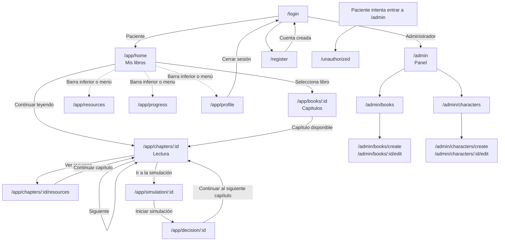
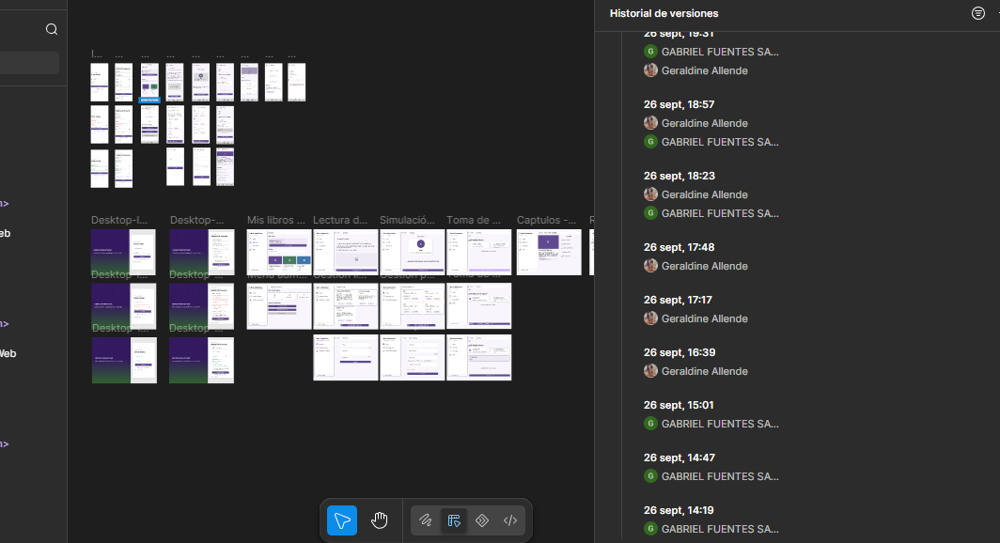

# Sistema de Libros Interactivos de Simulación

# Presentado por:
- Alexis Eduardo Escobar Figueroa — Frontend / Ionic + React
- Geraldine Valentina Allende López — UI/UX y Figma / Documentación
- Gabriel Alejandro Fuentes Sagardia — Frontend / Figma / Documentación y gestión
- Backend / API REST (EP2) — Responsabilidad compartida por todo el equipo

**Distribución de responsabilidades**
- **Frontend (Ionic + React):** estructura de vistas, rutas protegidas, rol y layouts (`routes/`, `layouts/`, `context/`, `hooks/`).
- **UI/UX y Figma:** mockups móvil/web, prototipo navegable, paleta y estilos de la aplicación (`theme/`, `components/`).
- **Backend (a desarrollar en EP2):** API REST, base de datos relacional, autenticación JWT.
- **Documentación y gestión:** README, servicios y datos de prueba (`services/`, `data/`), ramas y evidencia de avance.

## Índice
1. [Descripción general del sistema](#descripción-general-del-sistema)
    - [Objetivos](#objetivos-del-proyecto)
    - [Principales funcionalidades](#principales-funcionalidades)
2. [Justificación del problema](#justificación-del-problema)
    - [Análisis de soluciones existentes](#análisis-de-soluciones-existentes)
3. [Usuarios](#usuarios-objetivo-quién-usará-la-aplicación)
    - [Roles](#roles-del-sistema)
    - [Proto-personas](#proto-personas)
    - [Supuestos](#supuestos-utilizados)
4. [Requerimientos](#requerimientos)
5. [Arquitectura de la Información/ UX](#arquitectura-de-navegación)
    - [Diferenciación x roles](#diferenciación-de-acceso-según-roles)
    - [Flujos principales Tareas](#flujos-de-tareas)
    - [Puntos críticos de interacción](#puntos-críticos-de-interacción)
    - [Justificación Técnica](#justificación-técnica)
6. [Bocetos UX/UI](#bocetos-uiux)
7. [Librerías y Tecnologías](#librerías-usadas-con-react-ionic)
8. [Instalación y configuración](#instalación-y-configuración)
    - [Ejecución y uso](#ejecución-y-uso)
    - [Estructura del proyecto](#estructura-del-proyecto)
9. [Uso de herramientas de IA](#uso-de-herramientas-de-ia)
10. [Referencias](#referencias)

## Descripción general del sistema
El Sistema de Libros Interactivos de Simulación es una aplicación multiplataforma (web y móvil) desarrollada con Ionic + React que acompaña emocionalmente a pacientes en tratamiento oncológico mediante historias narrativas. El paciente lee libros organizados en capítulos, participa en simulaciones donde un personaje enfrenta situaciones cotidianas, toma decisiones que cambian el desenlace, reproduce recursos multimedia de apoyo y revisa su progreso. Los administradores (psicooncólogos) gestionan los libros y los personajes desde un panel propio.

**Alcance de la Entrega Parcial 1:** Frontend navegable con rutas públicas y protegidas, separación por roles, versiones móvil y web. También, datos simulados. La autenticación real (JWT), la base de datos y la API REST se implementan en la EP2.

### Objetivos del proyecto
**Objetivo general**

Desarrollar una aplicación web y móvil que centralice el acompañamiento emocional de pacientes oncológicos mediante libros interactivos con simulaciones y toma de decisiones, en un entorno seguro, accesible y confidencial.

**Objetivos específicos**
1. Caracterizar a los usuarios objetivo (pacientes y administradores) a partir de fuentes secundarias y análisis de soluciones existentes.
2. Diseñar un prototipo UI/UX en Figma, en versiones móvil y web, coherente con las necesidades de accesibilidad de los pacientes.
3. Implementar en Ionic + React una arquitectura de navegación con rutas públicas, rutas protegidas y diferenciación de acceso por rol.
4. Permitir que el paciente lea capítulos, participe en simulaciones, tome decisiones, reproduzca recursos multimedia y consulte su propio progreso.
5. Permitir que el administrador gestione el catálogo de libros y los personajes que participan en las simulaciones.
6. Proteger la identidad del paciente mediante el uso de alias, mensajes de error que no revelan información y acceso a estadísticas únicamente propias.

### Principales funcionalidades
| Funcionalidad | Rol | Requerimiento |
| :--- | :--- | :--- |
| Biblioteca con "Continúa donde lo dejaste" y buscador | Paciente | RF-02 |
| Lectura por capítulos con desbloqueo progresivo | Paciente | RF-02 |
| Simulación con personaje y contexto narrativo | Paciente | RF-03 |
| Toma de decisiones con confirmación y consecuencia | Paciente | RF-04 |
| Reproductor de recursos multimedia (audio/video) | Paciente y Administrador | RF-05 |
| Seguimiento de progreso y estadísticas propias | Paciente | RF-06 |
| Gestión de libros (crear, editar, eliminar) | Administrador | RF-01 |
| Gestión de personajes y asociación a capítulos | Administrador | RF-07 |
| Registro, inicio y cierre de sesión con control por rol | Todos | FT-01 a FT-04 |

---
## Justificación del problema
El tratamiento oncológico supone una carga emocional y psicológica importante. Según la Organización Mundial de la Salud (OMS) el cáncer es una de las principales causas de muerte en el mundo, con cerca de 10 millones de fallecimientos al año [[1]](#referencias). En 2022 hubo más de 4.2 millones de nuevos casos y se proyecta un aumento del 60 % al 2045 [[2]](#referencias). En Chile, el cáncer es una prioridad de salud pública abordada por la ley nacional del cáncer y el plan nacional de cáncer 2022-2027 [[4]](#referencias).

La OMS señala que la atención de estos pacientes no se limita a lo físico y es por eso que, los cuidados paliativos buscan mejorar la calidad de vida de pacientes y familias abordando también problemas psicosociales [[1]](#referencias)[[3]](#referencias). Sin embargo, en la práctica los pacientes suelen enfrentarse a un exceso de información médica (folletos estáticos o videos dispersos) que carece de un seguimiento estructurado. El equipo supone que, sumado a la fatiga propia del tratamiento, buscar y procesar consejos de autocuidado en múltiples plataformas genera frustración y aislamiento ([Supuestos](#supuestos-utilizados)).

Además, la falta de una plataforma centralizada que ofrezca experiencias narrativas interactivas provoca que el paciente se enfrente a su proceso en soledad sin un espacio seguro donde proyectar sus decisiones.

En este contexto, el problema abordado por el proyecto corresponde a la necesidad de centralizar el acompañamiento emocional del paciente a través de experiencias narrativas interactivas que le permitan desarrollar su proceso de tratamiento de forma segura y estructurada.

**Consecuencias de no abordar el problema:** el paciente continúa dependiendo de información dispersa y estática, aumenta la sensación de aislamiento durante los tiempos de espera del tratamiento y los profesionales no cuentan con una herramienta para ofrecer contenido de apoyo de forma continua.

Para ello, se propone un sistema de libros interactivos que transforme la lectura pasiva en una experiencia inmersiva. A través de simulaciones y toma de decisiones, el paciente puede explorar escenarios emocionales y cotidianos en un entorno seguro. Con el fin de centralizar el acompañamiento emocional del paciente, facilitar su consulta desde diferentes dispositivos y proporcionar una experiencia diferenciada.

### Análisis de soluciones existentes
| Solución | Enfoque | Qué aporta a nuestro diseño | Qué no cubre |
| :--- | :--- | :--- | :--- |
| **Untire** [[5]](#referencias) | Programa digital de autoayuda para la fatiga relacionada con el cáncer, con ejercicios y contenido psicoeducativo. | Confirma que los pacientes oncológicos usan apps de apoyo | No ofrece narrativas interactivas ni toma de decisiones. |
| **OWise** [[6]](#referencias) | Registro de síntomas y seguimiento personal para pacientes con cáncer. | Seguimiento de progreso propio y énfasis en privacidad de los datos. | Enfoque clínico de registro. No entrega contenido emocional narrativo. |
| **Headspace** [[7]](#referencias) | Meditación y bienestar general con audios guiados. | Audios breves de relajación y una interfaz calmada. | No es específico para pacientes oncológicos ni tiene historias con seguimiento. |
| **Folletos y videos del centro de salud** | Información estática entregada en papel o enlaces sueltos. | Contenido validado por profesionales. | No hay interacción, seguimiento ni centralización. |

**Conclusión:** las soluciones revisadas cubren el registro de síntomas o el bienestar general, pero ninguna combina **narrativa interactiva, simulación y decisiones** con un panel para que los profesionales publiquen contenido. Esa brecha es la que aborda este proyecto.

---
## Usuarios objetivo (Quién usará la aplicación)
La aplicación considera principalmente dos grupos de usuarios: **Usuario/Paciente y Administrador/Editor de Contenido**.

### Usuario / Paciente
Corresponde a usuarios en diversas etapas del tratamiento oncológico y que utilizan la plataforma principalmente en habitaciones de hospital durante la terapia, en salas de espera o en reposo domiciliario.

#### Necesidades principales
- Consumir contenido que reduzca la ansiedad.
- Registrar su progreso emocional.
- Tener confidencialidad sobre su identidad y su progreso.

#### Posibles dificultades
- Fatiga y baja tolerancia a textos largos.
- Menor precisión motriz (uso con una mano, vía intravenosa en el brazo, etc).
- Conexión a internet inestable en recintos hospitalarios.

#### Objetivos o tareas en el sistema
Leer capítulos, participar en simulaciones, tomar decisiones, escuchar o ver recursos de apoyo y revisar su avance.

#### Nivel estimado de experiencia tecnológica
**Básico a intermedio:** usa aplicaciones de mensajería, redes sociales y videollamadas.

#### Necesidades de accesibilidad, seguridad y privacidad
- Botones grandes (alrededor de 48 px de alto), texto de 16 px o más y alto contraste.
- Navegación con el pulgar (barra inferior en móvil).
- Uso de alias en lugar del nombre real.

### Administrador / Editor de Contenido
Corresponde a psicooncólogos, educadores de salud o personal de fundaciones, los cuales trabajan principalmente desde oficinas clínicas o teletrabajo.

#### Necesidades principales
- Publicar y actualizar contenido de apoyo sin procesos difíciles.
- Asociar personajes a los capítulos donde participan.
- Conocer de forma general el uso de la plataforma.

#### Objetivos o tareas en el sistema
Crear, editar y eliminar libros/personajes.

#### Nivel estimado de experiencia tecnológica
**Intermedio:** usa plataformas web de gestión en computador.

#### Necesidades de seguridad
- Acceso exclusivo al panel de administración.
- Confirmación antes de eliminar contenido.

---
## Roles del Sistema
- **Usuario / Paciente**: Persona que interactúa con los libros interactivos, navega capítulos y realiza el seguimiento de su progreso.
- **Administrador**: Usuario encargado de la gestión de libros y personajes dentro de la plataforma. Además, puede revisar en modo lectura las vistas del paciente.

### Definición de conceptos
**Rol**: Define qué puede hacer un usuario dentro del sistema.
**Proto-persona**: Describe quién podría ser ese usuario, sus características, necesidades, objetivos, dificultades y contexto de uso.

**Por ejemplo**
*Rol*: Usuario/Paciente
*Proto-persona*: Paciente adulto de 45 años que recibe quimioterapia semanal y utiliza principalmente tablet durante sus sesiones de tratamiento.

---
## Proto-personas
*Estos perfiles son caracterizaciones preliminares construidas a partir de fuentes secundarias y supuestos razonados del equipo, no de entrevistas a usuarios reales.*

---
### Proto-persona 1: Paciente en tratamiento oncológico activo

**Nombre ficticio:** Elena Rojas
**Tipo de usuario o rol:** Usuario / Paciente

#### Características generales

Elena tiene 45 años y es profesora con licencia médica. Actualmente se encuentra recibiendo quimioterapia intravenosa de forma semanal. Su nivel de manejo tecnológico es básico/intermedio.

#### Necesidades principales

- Sentirse comprendida sin tener que leer contenido médico extenso.
- Contar con distracciones constructivas durante sus terapias.

#### Objetivos de uso

Leer historias de personajes que atraviesan situaciones similares a la suya y tomar decisiones para ver distintos desenlaces.

#### Dificultades o puntos de frustración

- Se agota rápidamente leyendo pantallas con mucho texto.
- Le frustran las interfaces con botones pequeños.

#### Funcionalidades de la aplicación que utilizaría

- Navegación de Capítulos (RF-02).
- Ejecución de Simulación (RF-03).
- Toma de Decisiones (RF-04).
- Reproducción Multimedia (RF-05).
- Consulta de Progreso (RF-06).

#### Dispositivo y contexto probable de acceso

Utilizaría principalmente **tablet y teléfono móvil**. Accede recostada en la clínica durante sus sesiones de tratamiento o desde su cama en reposo domiciliario.

---
### Proto-persona 2: Administrador y editor de contenido narrativo

**Nombre ficticio:** Martín Vargas
**Tipo de usuario o rol:** Administrador / Editor de Contenido (Psicooncólogo)

#### Características generales

Martín tiene 38 años y es psicólogo en una fundación oncológica. Está acostumbrado a redactar material de apoyo para sus pacientes. Su nivel de manejo tecnológico es intermedio.

#### Necesidades principales

- Centralizar sus guías de apoyo en una herramienta interactiva.
- Lograr que sus pacientes participen activamente del contenido.

#### Objetivos de uso

Crear un libro, definir los personajes que participan en sus simulaciones y revisar cómo lo ve el paciente.

#### Dificultades o puntos de frustración

- Falta de tiempo.
- Le frustran los sistemas complejos que requieren muchos clics para publicar un texto.

#### Funcionalidades de la aplicación que utilizaría

- Gestión de Libros (RF-01).
- Reproducción Multimedia (RF-05).
- Consulta de Progreso, resumen global (RF-06).
- Gestión de Personajes (RF-07).

#### Dispositivo y contexto probable de acceso

Utilizaría principalmente la **versión web desde un computador de escritorio**, durante horario de oficina.

---
### Supuestos utilizados
Los perfiles anteriores se construyeron a partir de los siguientes supuestos:

1. Los pacientes son adultos (18 años o más) en tratamiento ambulatorio y tienen acceso a un teléfono o tablet propio o de un familiar.
2. Las sesiones de tratamiento incluyen tiempos de espera en los que el paciente puede usar la aplicación.
3. La fatiga asociada al tratamiento reduce la tolerancia a textos largos, por lo que los capítulos deben ser breves.
4. La conexión a internet en recintos hospitalarios puede ser lenta o intermitente.
5. El paciente prefiere no exponer su nombre real ni su diagnóstico dentro de la aplicación.
6. Los administradores son profesionales de salud mental o educación que trabajan desde un computador y validan el contenido que publican.
7. La aplicación es un complemento de apoyo emocional.

## Requerimientos

## Requerimientos Funcionales por Rol

| ID | Nombre | Descripción | Rol | Precondiciones | Flujo Principal | Resultado Esperado |
| :--- | :--- | :--- | :--- | :--- | :--- | :--- |
| **RF-01** | Gestión de Libros | Permite crear, editar y eliminar libros interactivos (título y sinopsis). La gestión de capítulos, simulaciones y recursos de cada libro se incorpora en la EP2 junto con la API. | Administrador | Estar autenticado como administrador. | 1. Accede a "Gestión de libros".<br>2. Presiona "Nuevo libro" o "Editar".<br>3. Completa título y sinopsis y guarda (o confirma la eliminación). | El catálogo se actualiza y se muestra un mensaje de confirmación. |
| **RF-02** | Navegación de Capítulos | Permite acceder y leer el contenido de un libro. Los capítulos se desbloquean al completar el anterior. | Usuario/Paciente | Tener un libro seleccionado. | 1. Abre el libro desde "Mis libros".<br>2. Selecciona un capítulo disponible.<br>3. Lee y avanza. | El contenido del capítulo se muestra y queda guardado como última lectura. |
| **RF-03** | Ejecución de Simulación | Activa el entorno narrativo donde ocurre la interacción con un personaje. | Usuario/Paciente | Estar en un capítulo que termina en simulación. | 1. Presiona "Ir a la simulación".<br>2. El sistema muestra el personaje y el contexto.<br>3. Presiona "Iniciar simulación". | La interfaz cambia al modo de toma de decisión. |
| **RF-04** | Toma de Decisiones | Registra la elección del usuario ante un escenario narrativo. | Usuario/Paciente | Simulación iniciada con opciones en pantalla. | 1. Lee la pregunta.<br>2. Selecciona una tarjeta de opción.<br>3. Presiona "Confirmar decisión". | Se registra la elección, se muestra su consecuencia y se desbloquea el siguiente capítulo. |
| **RF-05** | Reproducción Multimedia | Permite visualizar videos o escuchar audios complementarios. | Usuario/Paciente y Administrador | Estar en una vista con recursos asociados. | 1. Presiona la pestaña "Recursos".<br>2. Selecciona un recurso y presiona reproducir. | El archivo se reproduce. |
| **RF-06** | Consulta de Progreso | Muestra el porcentaje de avance, capítulos completados, pendientes. | Usuario/Paciente (propio) y Administrador (resumen global) | Tener interacción previa con al menos un libro. | 1. Accede a "Mi progreso".<br>2. El sistema calcula el avance por libro. | Se visualizan barras de progreso y estadísticas. |
| **RF-07** | Gestión de Personajes | Permite crear, editar y eliminar personajes. | Administrador | Estar autenticado como administrador. | 1. Accede a "Gestión de personajes".<br>2. Define nombre, descripción, atributos y capítulo asociado.<br>3. Guarda. | El personaje queda disponible para las simulaciones del capítulo. |

---

### Funcionalidades Transversales

Las siguientes funcionalidades son necesarias para el funcionamiento general de la aplicación pero no forman parte de los siete requerimientos funcionales principales.

- **FT-01:** El sistema deberá permitir el registro de nuevos usuarios/pacientes (`/register`).
- **FT-02:** El sistema deberá permitir a los usuarios iniciar sesión mediante sus credenciales (`/login`).
- **FT-03:** El sistema deberá permitir cerrar una sesión activa (desde "Perfil" o el menú lateral).
- **FT-04:** El sistema deberá restringir las funcionalidades disponibles de acuerdo con el rol del usuario autenticado (Usuario/Paciente vs. Administrador).

---

## Requerimientos No Funcionales

### UX y Usabilidad

#### RNF-UX-01 — Usabilidad

El acceso al último capítulo leído deberá lograrse en un máximo de 3 clics desde el inicio. En la implementación actual se logra en 1 clic con el botón "Continuar leyendo" de `/app/home`.

---

### Accesibilidad

#### RNF-ACC-01 — Accesibilidad visual

La interfaz deberá mantener un contraste de colores WCAG AA (mínimo 4.5:1) [[8]](#referencias) y usar botones de alrededor 48 px de alto. Se validará con herramientas automatizadas como WAVE.

---

### Seguridad

#### RNF-SEG-01 — Autenticación y almacenamiento de contraseñas

El sistema utilizará JWT para el manejo de sesiones y contraseñas hasheadas con bcrypt. Se validará mediante análisis de tokens y verificación de base de datos.

#### RNF-SEG-02 — Privacidad de datos del paciente

El sistema no solicitará datos personales innecesarios (RUT, diagnóstico), identificará al paciente mediante un alias, mostrará mensajes de error de inicio de sesión que no revelen qué correos están registrados y permitirá a cada paciente ver solo su propio progreso. Se validará mediante revisión de formularios y pruebas de acceso entre cuentas.

---

### Rendimiento

#### RNF-REN-01 — Tiempos de respuesta

La API REST deberá responder solicitudes en menos de 200 ms, e Ionic deberá renderizar las vistas en menos de 1.5 segundos. Mientras se cargan los datos, la interfaz mostrará indicadores de carga (`IonSkeletonText`, `IonSpinner`). Se validará mediante pruebas de carga y auditorías con Lighthouse.

---

### Compatibilidad

#### RNF-COM-01 — Navegadores y dispositivos compatibles

El sistema deberá ejecutarse en la web con una interfaz adaptable a móvil y escritorio. Se validará mediante pruebas en distintos tamaños de pantalla.

---
## Arquitectura de Navegación
### 1. Rutas principales y secundarias

La aplicación considera rutas públicas, una ruta común y rutas protegidas. Las rutas del paciente usan el prefijo `/app` y las del administrador el prefijo `/admin` (ver [Justificación Técnica](#justificación-técnica)).

#### Rutas públicas

| Ruta | Vista | Descripción |
|---|---|---|
| `/` | Redirección | Redirección automática a `/login`. |
| `/login` | Inicio de sesión | Permite al usuario autenticarse en el sistema. |
| `/register` | Registro | Permite el registro de un nuevo usuario/paciente. |

#### Ruta común

| Ruta | Vista | Descripción |
|---|---|---|
| `/unauthorized` | Acceso denegado | Destino de un usuario que intenta entrar a una sección sin el rol requerido. |

#### Rutas protegidas del Usuario / Paciente

| Ruta | Vista | Descripción |
|---|---|---|
| `/app/home` | Mis libros | Inicio, "Continúa donde lo dejaste" y biblioteca de libros. |
| `/app/books/:id` | Detalle de libro | Portada, sinopsis, avance y lista de capítulos. |
| `/app/chapters/:id` | Lectura de capítulo | Lectura del capítulo. |
| `/app/chapters/:id/resources` | Recursos del capítulo | Recursos multimedia asociados al capítulo. |
| `/app/simulation/:id` | Simulación | Personaje y contexto de la simulación. |
| `/app/decision/:id` | Toma de decisión | Opciones, confirmación y consecuencia. |
| `/app/resources` | Recursos | Todos los recursos multimedia de apoyo. |
| `/app/progress` | Mi progreso | Seguimiento de progreso y estadísticas propias. |
| `/app/profile` | Perfil | Datos de la cuenta y cierre de sesión. |
| `/app/characters` | Personajes | Galería de personajes (planificada para EP2). |

#### Rutas protegidas del Administrador

| Ruta | Vista | Descripción |
|---|---|---|
| `/admin` | Panel de administración | Resumen de contenido y accesos rápidos. |
| `/admin/books` | Gestión de libros | Listado de libros con acciones editar y eliminar. |
| `/admin/books/create` | Crear libro | Creación de un nuevo libro. |
| `/admin/books/:id/edit` | Editar libro | Edición de un libro existente. |
| `/admin/characters` | Gestión de personajes | Listado de personajes con acciones editar y eliminar. |
| `/admin/characters/create` | Crear personaje | Creación de un personaje y asociación a un capítulo. |
| `/admin/characters/:id/edit` | Editar personaje | Edición de un personaje existente. |
| `/admin/chapters` | Gestión de capítulos | Planificada para EP2. |
| `/admin/simulations` | Gestión de simulaciones | Planificada para EP2. |
| `/admin/resources` | Gestión de recursos | Planificada para EP2. |
| `/admin/progress` | Estadísticas | Planificada para EP2. |

### 2. Relaciones jerárquicas entre vistas
La aplicación se organiza mediante una estructura jerárquica en la que las funcionalidades disponibles dependen del rol del usuario autenticado.

```text
IonApp
└── IonReactRouter
    └── IonSplitPane (menú lateral fijo en web)
        ├── AppMenu (IonMenu con opciones según el rol)
        └── IonRouterOutlet principal
            │
            ├── Rutas públicas
            │   ├── /
            │   ├── /login
            │   └── /register
            │
            ├── Ruta común
            │   └── /unauthorized
            │
            └── Rutas protegidas
                │
                ├── UserLayout — /app/* (Usuario / Paciente)
                │   ├── /app/home
                │   │   └── /app/books/:id
                │   │       └── /app/chapters/:id
                │   │           ├── /app/chapters/:id/resources
                │   │           └── /app/simulation/:id
                │   │               └── /app/decision/:id
                │   ├── /app/resources
                │   ├── /app/progress
                │   └── /app/profile
                │
                └── AdminLayout — /admin/* (Administrador)
                    ├── /admin
                    ├── /admin/books
                    │   ├── /admin/books/create
                    │   └── /admin/books/:id/edit
                    └── /admin/characters
                        ├── /admin/characters/create
                        └── /admin/characters/:id/edit
```

La aplicación utiliza un enfoque de componentes contenedores (Layouts) para encapsular la navegación.

- **UserLayout:** Contenedor principal para pacientes. Contiene un `IonTabs` con su propio `IonRouterOutlet` para las rutas `/app/*` y la barra inferior (`IonTabBar`) con Inicio, Recursos, Progreso y Perfil.
- **AdminLayout:** Contenedor para administradores. Agrupa las rutas `/admin/*` en un `IonRouterOutlet`.
- **AppMenu:** Menú lateral (`IonMenu`) común a ambos roles.
- **Vistas Hoja:** Componentes como `ChapterPage` o `DecisionPage` que se montan dentro del `IonRouterOutlet` del Layout correspondiente.

### 3. Flujo de navegación entre funcionalidades



### 4. Navegación adaptada por dispositivo
El layout detecta el tamaño de pantalla para ajustar la interfaz sin duplicar lógica:
- **Dispositivos Móviles:** Se utiliza `IonTabs` anclado en la parte inferior (`IonTabBar`). El administrador abre el menú lateral con el botón de menú (`IonMenuButton`).
- **Versión Web (Escritorio):** A partir de pantallas grandes (`lg`), `IonSplitPane` deja fijo el `IonMenu` lateral y la barra inferior se oculta.

---
## Diferenciación de acceso según roles

La aplicación controla el acceso a las diferentes funcionalidades de acuerdo con el rol del usuario autenticado. Se consideran dos roles principales: **Usuario/Paciente** y **Administrador**.

- Un usuario no autenticado que intente acceder a una ruta protegida (`/app/*` o `/admin/*`) es redirigido a `/login`.
- Un usuario autenticado que visite `/login` o `/register` es redirigido a `/app/home` o `/admin` según su rol.
- Un paciente que intente acceder a rutas administrativas es redirigido a `/unauthorized`.
- Una ruta inexistente redirige a `/login` (o muestra "Página no encontrada" dentro de `/app`).

### Resumen de acceso por rol

| Funcionalidad | Usuario / Paciente | Administrador |
| :--- | :--- | :--- |
| **RF-01: Gestión de Libros** | Sin acceso | Acceso total (CRUD) |
| **RF-02: Navegación de Capítulos** | Acceso total (Lectura) | Acceso total (Revisión) |
| **RF-03: Ejecución de Simulación** | Acceso total | Acceso de prueba |
| **RF-04: Toma de Decisiones** | Acceso total | Acceso de prueba |
| **RF-05: Reproducción Multimedia** | Acceso total | Acceso total |
| **RF-06: Consulta de Progreso** | Solo métricas propias | Resumen global en el panel |
| **RF-07: Gestión de Personajes** | Sin acceso | Acceso total (CRUD) |

---

### Acceso del Usuario / Paciente

El usuario/paciente tendrá acceso a las funcionalidades relacionadas con la lectura y la experiencia narrativa dentro de la plataforma.

Podrá:

- navegar el catálogo de libros y ver el detalle de cada uno
- leer capítulos y avanzar en la narrativa
- participar en simulaciones y tomar decisiones
- reproducir recursos multimedia de apoyo
- consultar su propio progreso
- revisar su perfil y cerrar sesión

---

### Acceso del Administrador

El administrador tendrá acceso a las funcionalidades de gestión de contenido de la plataforma.

Podrá:

- gestionar libros (crear, editar, eliminar)
- gestionar personajes y asociarlos a capítulos
- revisar la navegación de capítulos y probar simulaciones
- reproducir recursos multimedia
- consultar un resumen global de la plataforma (libros, capítulos, personajes y pacientes registrados)

---

### Control de acceso a rutas

La diferenciación por roles se aplica tanto en la interfaz como en las rutas, mediante tres componentes ubicados en `src/routes/`:

| Guardia | Rutas que protege | Comportamiento |
| :--- | :--- | :--- |
| `PublicOnlyRoute` | `/login`, `/register` | Si ya hay sesión, redirige a `/app/home` o `/admin`. |
| `PrivateRoute` | `/app/*` | Sin sesión, redirige a `/login`. |
| `RoleRoute` | `/admin/*` | Sin sesión, redirige a `/login`. Con otro rol, a `/unauthorized`. |

---
## Flujos de Tareas

---

### Task Flow 1: Lectura y toma de decisión

**Rol:** Usuario / Paciente

**Objetivo:** leer la narrativa de un capítulo, participar en la simulación y tomar una decisión que haga avanzar la historia.

```text
Inicio de sesión (/login)
      ↓
Selecciona libro (/app/home)
      ↓
Selecciona capítulo disponible (/app/books/:id)
      ↓
Lee la historia (/app/chapters/:id)
      ↓
Inicia simulación (/app/simulation/:id)
      ↓
Selecciona una opción y confirma (/app/decision/:id)
      ↓
Ve la consecuencia, se guarda el progreso y continúa al siguiente capítulo
```
---

### Task Flow 2: Revisión de progreso

**Rol:** Usuario / Paciente

**Objetivo:** revisar el avance realizado con las lecturas.

```text
Inicio de sesión (/login)
      ↓
Navega con la barra inferior (móvil) o el menú lateral (web)
      ↓
Visualiza estadísticas y avance por libro (/app/progress)
      ↓
Presiona "Continuar leyendo" o vuelve al inicio
```
---

### Task Flow 3: Creación de contenido narrativo

**Rol:** Administrador

**Objetivo:** registrar un nuevo libro y los personajes que participarán en sus simulaciones.

```text
Inicio de sesión (/login)
      ↓
Accede al panel de administración (/admin)
      ↓
Crea el libro base (/admin/books/create)
      ↓
Crea un personaje y lo asocia a un capítulo (/admin/characters/create)
      ↓
Guarda y revisa el resultado en la vista del paciente (/app/home)

```
---
## Puntos críticos de interacción

Para este caso de estudio se identifican los siguientes puntos críticos:

1. **El momento de la decisión en la simulación:**
   * Fricción: Riesgo de toques accidentales.
   * Solución: Opciones como tarjetas amplias (`IonCard`). Tocar una tarjeta solo la selecciona y la resalta. La decisión se registra al presionar el botón "Confirmar decisión" en la parte inferior que está deshabilitado hasta elegir una opción.
2. **Capítulos bloqueados:**
   * Fricción: El paciente podría intentar abrir un capítulo sin haber completado el anterior.
   * Solución: Los capítulos muestran su estado (completado, disponible o bloqueado) con ícono y texto. Al tocar uno bloqueado aparece un `IonToast` explicativo.
3. **Errores de inicio de sesión:**
   * Fricción: Un mensaje que diga "correo no registrado" revela quién usa la aplicación.
   * Solución: Mensaje genérico ("Correo o contraseña incorrectos.") y validaciones de formato antes de enviar.
---
### Justificación Técnica

### Usabilidad
Minimizar la carga cognitiva del paciente, manteniendo estructuras predecibles (Layouts constantes), controles al alcance del dedo (`IonTabs`).

### Eficiencia de interacción
El uso de React Router con `IonRouterOutlet` permite mantener el estado de navegación de Ionic sin recargar el DOM. El botón "Continuar leyendo" lleva al último capítulo en un solo clic.

### Claridad estructural
Las vistas se organizan mediante componentes contenedores (Layouts) según el rol del usuario autenticado: `UserLayout` para pacientes y `AdminLayout` para administradores. El código se separa en carpetas `pages`, `components`, `routes`, `services`, `layouts`, `context` y `hooks`.

### Escalabilidad
Encapsular la lógica en Layouts independientes permite hacer crecer el panel de administración sin sobrecargar el área del paciente. Los servicios (`src/services/`) devuelven promesas, igual que lo hará la API REST: en la EP2 solo cambia su interior por llamadas `fetch`/Axios y las pantallas no se modifican.

### Seguridad
Las validaciones de ruta (`PrivateRoute`, `RoleRoute`, `PublicOnlyRoute`) actúan como primera barrera (Frontend). Al cerrar sesión la aplicación se recarga para que ninguna vista privada quede puesta.

### Decisiones de implementación
- **Prefijo `/app` en las rutas del paciente:** inicialmente el layout con pestañas se puso en la raíz (`/*`), pero en Ionic 9 esa ruta  captura todas las URL y dejaba la página invisible al pasar de `/login` al inicio. Con `/app/*` cada rol tiene su propio prefijo, igual que `/admin/*`.
- **Hook `usePageEnter`:** Este hook recarga los datos cada vez que una página vuelve a estar activa para que el progreso siempre esté actualizado.

---
## Bocetos UI/UX
[Figma - Prototipo de UI/UX](https://www.figma.com/design/V9QFnXbBVuZYb6xRnxik6c/EP1_Prototipo_Libros_Interactivos?node-id=0-1&t=4Z5sW8yxSsm7sCnD-1)

[Figma - Prototipo navegable](https://www.figma.com/proto/V9QFnXbBVuZYb6xRnxik6c/EP1_Prototipo_Libros_Interactivos?node-id=0-1&p=f&t=4Z5sW8yxSsm7sCnD-0&scaling=contain&content-scaling=fixed&starting-point-node-id=1%3A2&show-proto-sidebar=1)



### Criterios de diseño
- **Paleta de colores:** Tonos tranquilizadores con contraste WCAG AA verificado:

  | Uso | Color | Contraste con blanco |
  | :--- | :--- | :--- |
  | Primario (botones, enlaces) | Violeta `#5B4A8B` | 7.5:1 |
  | Secundario | Verde apagado `#3F6E55` | 5.9:1 |
  | Error | Rojo `#B3261E` | 6.5:1 |
  | Fondo | Lavanda claro `#FAF8FD` | — |
  | Texto | `#1F1B2D` | — |

- **Tipografía:** Sans-serif limpia (Inter o Roboto). Tamaño base de 16px y lectura de capítulos a 18px.
- **Coherencia e Iconografía:** Uso exclusivo de Ionicons [[10]](#referencias). Sistema de espaciado basado en múltiplos de 8px. Botones de alrededor de 48px de alto y esquinas redondeadas.
- **Navegación:** Barra inferior (`IonTabBar`) en móvil y menú lateral fijo (`IonMenu`) en web.

### Justificación de los campos del formulario de registro
El registro solicita solo la información necesaria para crear y proteger la cuenta del paciente:

| Campo | Obligatorio | Formato y validación | Justificación |
| :--- | :--- | :--- | :--- |
| Nombre de usuario (alias) | Sí | 3 a 20 caracteres: letras, números, `_` o `.` | Identifica al paciente dentro de la app sin usar su nombre real (confidencialidad). |
| Correo electrónico | Sí | Formato `nombre@dominio.cl` | Credencial de acceso y futura recuperación de contraseña. No se muestra a otros usuarios. |
| Contraseña | Sí | Mínimo 8 caracteres, una mayúscula y un número (indicador en tiempo real) | Protege el acceso a información sensible sobre el proceso emocional del paciente. |
| Confirmar contraseña | Sí | Debe coincidir con la contraseña | Evita errores de tipeo al crear la cuenta. |
| Aceptación de términos y privacidad | Sí | Casilla marcada | Consentimiento para el tratamiento de los datos de uso. |


**Representación en los formularios de inicio de sesión y registro:**
- Campos obligatorios marcados con `*` y la nota "* Campo obligatorio".
- Formato esperado indicado con textos de ayuda bajo el campo.
- Validación al salir de cada campo y al enviar, con mensajes de error en rojo bajo el campo correspondiente.
- Retroalimentación al enviar: indicador de carga en el botón y `IonToast` de éxito al crear la cuenta.
- Reglas de seguridad de la contraseña visibles, con check verde al cumplirse.
- Error de inicio de sesión ("Correo o contraseña incorrectos.") para no revelar qué correos están registrados.

---
## Librerías usadas con React (Ionic)

### Librerías principales

| Librería | Versión | Propósito |
|---|---|---|
| `react` / `react-dom` | 19.0.0 | Construcción de la interfaz mediante componentes. |
| `@ionic/react` | ^9.0.0 | Estructura de vistas y componentes de interfaz de Ionic. |
| `@ionic/react-router` | ^9.0.0 | Integración de Ionic con React Router (`IonReactRouter`, `IonRouterOutlet`). |
| `react-router-dom` | ^6.30.0 | Navegación entre las diferentes vistas de la aplicación. |
| `ionicons` | ^8.1.0 | Íconos de la interfaz. |

### Herramientas de desarrollo

| Herramienta | Propósito |
|---|---|
| TypeScript ~5.9 | Tipado estático del código. |
| Vite | Servidor de desarrollo y compilación. |
| Vitest y Testing Library | Pruebas unitarias. |
| Cypress | Pruebas end-to-end de rutas y roles. |
| ESLint | Revisión de estilo del código. |

## Tecnologías
- **Ionic Framework 9**
- **React 19 + TypeScript**
- **React Router 6**
- **Figma** (prototipo UI/UX)
- **API REST** (Backend, a desarrollar en EP2)
- **Autenticación JWT** (EP2)
- **Capacitor** (empaquetado móvil proyectado, Android 10+ / iOS 14+)

---

## Instalación y configuración

**Requisitos:** Node.js 22 LTS (o 20.19 o superior) y npm.

```bash
git clone https://github.com/Al3xiiss/API-del-Sistema-de-Libros-Interactivos-de-Simulacion/tree/main
cd API-del-Sistema-de-Libros-Interactivos-de-Simulacion
git checkout frontend
cd frontend
npm install
```

## Ejecución y uso

Desde la carpeta `frontend`:

```bash
npm run dev       
```

La aplicación queda disponible en `http://localhost:5173`. Otros comandos:

| Comando | Qué hace |
|---|---|
| `npm run build` | Compila TypeScript y genera la versión de producción en `dist/` |
| `npm run test.unit` | Pruebas unitarias (Vitest) |
| `npm run test.e2e` | Pruebas end-to-end (Cypress; requiere `npm run dev` en ejecución) |
| `npm run lint` | Revisión de estilo con ESLint |

### Cuentas de prueba

En la EP1 la autenticación es **simulada** (no hay backend).

| Rol | Correo | Contraseña |
|---|---|---|
| Paciente | `paciente@demo.cl` | `Paciente123` |
| Administrador | `admin@demo.cl` | `Admin12345` |

También se puede crear un paciente nuevo en `/register`. Para volver a los datos iniciales, borrar el `localStorage` del sitio (DevTools → Application → Local Storage).

### Cómo probar la separación por roles
1. Sin sesión, abrir `http://localhost:5173/app/home` → redirige a `/login`.
2. Iniciar sesión como paciente → llega a `/app/home` con la barra inferior (móvil) o el menú lateral (web).
3. Como paciente, escribir `/admin` en la barra de direcciones → redirige a `/unauthorized`.
4. Cerrar sesión e iniciar como administrador → llega a `/admin` con el menú de gestión.
5. Para ver la versión móvil en el computador, usar el modo dispositivo de DevTools (`F12` → ícono de celular).

## Estructura del proyecto

```text
frontend/src/
├── App.tsx              IonApp + IonReactRouter + IonSplitPane (menú lateral en web)
├── routes/              AppRoutes (mapa de rutas) y guardias: PrivateRoute, RoleRoute, PublicOnlyRoute
├── layouts/             UserLayout (IonTabs del paciente) y AdminLayout (rutas /admin/*)
├── pages/
│   ├── public/          LoginPage, RegisterPage
│   ├── user/            Home, BookDetail, Chapter, Simulation, Decision, Resources, Progress, Profile
│   ├── admin/           AdminHome, AdminBooks, AdminBookForm, AdminCharacters, AdminCharacterForm
│   └── common/          Unauthorized, NotFound
├── components/          AppMenu, PageHeader, BookCard, ChapterListItem, DecisionOptionCard,
│                        MediaPlayer, AdminItemCard, EmptyState
├── context/             AuthContext (usuario y rol en sesión)
├── services/            authService, bookService, characterService, progressService (datos simulados)
├── hooks/               usePageEnter (recarga datos al volver a una página)
├── data/                mockData (libros, capítulos, simulaciones, personajes, recursos)
├── types/               Tipos del dominio
├── utils/               Validaciones de formularios
└── theme/               Paleta (variables.css) y estilos globales (global.css)
```

---
## Uso de herramientas de IA
Conforme a lo permitido por la pauta, el equipo utilizó asistentes de inteligencia artificial como **apoyo** para revisar la documentación frente a la rúbrica y para generar una base inicial del código del frontend. Ese código fue revisado, adaptado, probado y modificado por el equipo. Por último, los bocetos y prototipos de Figma se construyeron manualmente.

---
## Referencias
1. Organización Mundial de la Salud. *Cáncer* (nota descriptiva). https://www.who.int/es/news-room/fact-sheets/detail/cancer
2. Organización Panamericana de la Salud. *Cáncer*. https://www.paho.org/es/temas/cancer
3. Organización Panamericana de la Salud. *Cuidados paliativos: guías para el manejo clínico*. https://www.paho.org/es/documentos/cuidados-paliativos-guias-para-manejo-clinico
4. Ministerio de Salud de Chile. *Plan Nacional de Cáncer 2022-2027*. https://www.minsal.cl/plan-nacional-de-cancer/
5. Tired of Cancer. *Untire: digital therapy for cancer-related fatigue*. https://tiredofcancerapp.com/ — Protocolo de estudio: https://pubmed.ncbi.nlm.nih.gov/32130185/
6. OWise. *OWise – Cancer support app*. https://owise.uk/
7. Headspace. *Meditación y mindfulness*. https://www.headspace.com/
8. W3C. *Web Content Accessibility Guidelines (WCAG) 2.1 — Contrast (Minimum)*. https://www.w3.org/TR/WCAG21/#contrast-minimum
9. Ionic Framework. *React Navigation*. https://ionicframework.com/docs/react/navigation
10. Ionic. *Ionicons*. https://ionic.io/ionicons